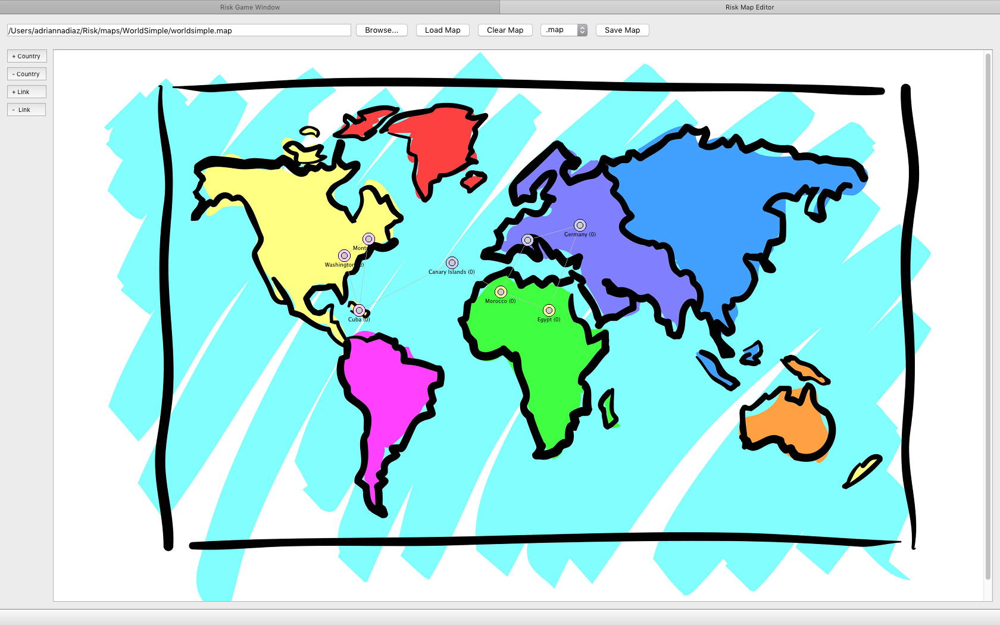

# RISK
Replica of the Strategy Game called Risk (Produced by Hasbro).

This game was developed for the course COMP345 Advanced C++ Programming, using Qt5.

Stewart Adam
Adrianna Diaz
Elliot Gimple
Elias Haroun
Taimoor Rana

##FEATURES
GUI application built with Qt5
Interactive Map Editor with a sophisticated Graph ADT
Real-time exportable logging of all events
Built-in AI with simple heuristics for computer players
Supports saving and loading of game state

##SCREENSHOTS

##INSTALLATION:
You will need C++, cmake, QT5, and Cereal.
###For macOS: 
For dependencies: `brew install cereal && brew install qt5`
To build: `./build.sh && cd build/osx/gui/ && make all`
GUI executable can be found at build/osx/gui/risk-gui.app, double-click it with Finder... or if you are hard-core commandline user `open -a risk-gui.app` 
###Other operating systems such as Windows and Linux, please refer to the `build/` folder 
